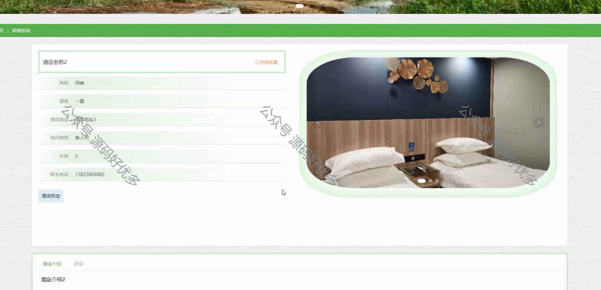

 
## 查看主页获取源码

> **作者介绍**： **✌**全网粉丝10W+本平台特邀作者、博客专家、CSDN新星计划导师、java领域优质创作者,博客之星、掘金/华为云/阿里云/InfoQ等平台优质作者、专注于项目实战 **✌**

  

### 一、作品包含

源码+数据库+设计文档万字+PPT+全套环境和工具资源+部署教程

### 二、项目技术

前端技术：Html、Css、Js、Vue、Element-ui

数据库：MySQL

后端技术：Java、Spring Boot、MyBatis

  

### 三、运行环境

开发工具：IDEA/eclipse

数据库：MySQL5.7

数据库管理工具：Navicat10以上版本

环境配置软件： JDK1.8+Maven3.6.3

前端Nodejs：14

### 四、项目介绍
项目编号：springbootA104

甘肃旅游管理系统是在甘肃省丰富旅游资源背景下开发的一套综合性信息平台，旨在通过信息化手段整合甘肃的历史文化遗迹、自然风光、民族风情等旅游资源，为旅游企业提供高效的管理工具，为游客提供详尽的旅游信息和服务，促进甘肃旅游业的可持续发展，提升旅游体验，推动地区经济繁荣。

前台用户功能：浏览首页、热门景点、酒店信息、推荐线路、旅游攻略、景点资讯、后台管理、个人中心。

后台分为管理员和用户
管理员的功能：系统首页、个人中心、用户管理、热门景点管理、景点类型管理、门票预定管理、酒店信息管理、酒店预定管理、推荐线路管理、旅游攻略、系统管理。
用户的功能：系统首页、个人中心、门票预定管理、酒店预定管理。

### 五、运行截图

  

